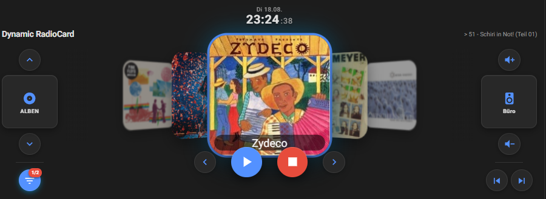

# Dynamic RadioCard

[](https://github.com/hacs/integration)
[](https://github.com/badboiaustria/dynamic-radiocard/releases)
[](LICENSE)
[](https://www.home-assistant.io/)

A dependency-free custom Lovelace card that turns your **Music Assistant**
library into a 3D cover-flow carousel — radio stations, podcasts, tracks,
albums and artists in a single card, controlled by click, swipe or keyboard.



*Deutsche Kurzfassung: [README.de.md](README.de.md)*

## Features

**Library browsing**

- Five categories, switched with the arrows on the left: **Radio · Podcasts ·
  Tracks · Albums · Artists**.
- Per category you decide whether only **favorites** or the **whole library**
  is loaded (`favorites_only`).
- **Provider filter** (funnel icon): Spotify, TuneIn, RadioBrowser, Apple
  Music, YouTube Music, SoundCloud, Deezer, Tidal, Qobuz, Plex, Jellyfin,
  Subsonic, local files and more. Selections are remembered per category; a
  badge shows how many filters are active.
- Albums sorted by **latest additions** or **alphabetically** (`album_sort`).

**Interaction**

- Click a side cover → it rotates to the center (3D cover flow).
- Click the center cover → play / pause, or switch to that item.
- **Swipe** with touch or mouse; a long fast swipe skips several items.
- **Keyboard**: ←/→ to browse, Space/Enter for play/pause.
- **Grid view** (`grid_mode`): the center click opens all items of the
  category as a scrollable grid.
- Transport bar: play/pause, stop, previous/next track, volume up/down.

**Player handling**

- The active **Music Assistant player** is shown on the right, with a green
  dot while something is playing; clicking it opens a player picker.
- Players are **discovered automatically** — from the HA entity registry, a
  state-attribute scan and the MA server itself; there is no entity list to
  maintain. Details:
  [docs/configuration.md](docs/configuration.md#where-the-players-come-from).
- Unwanted players can be hidden with a regex (`hide_players`).
- Last used player, category and filters are remembered in the browser
  (localStorage) and restored on the next load.

**Looks & languages**

- Clock with date and a now-playing line in the header.
- Cover size adjustable (`image_scale`), animations can be disabled for older
  wall tablets (`smooth_animation: false`).
- **English and German** built in. `language: auto` (default) follows the HA
  user profile; adding another language is a small pull request — see
  [docs/development.md](docs/development.md).

## Requirements

- Home Assistant 2024.4 or newer.
- [Music Assistant](https://www.music-assistant.io/) with at least one player.
- A Music Assistant **long-lived token** for the direct WebSocket connection
  (Music Assistant web UI → profile → *Long-Lived Tokens*). Without a token
  the card falls back to `browse_media` — it works, but without the provider
  filter.

## Installation

### HACS (recommended)

1. HACS → three-dot menu → **Custom repositories**.
2. Add `https://github.com/badboiaustria/dynamic-radiocard` with type
   **Dashboard**.
3. Search for **Dynamic RadioCard**, install, and reload your browser.
   HACS registers the resource automatically.

### Manual

1. Download `dynamic-radiocard.js` from the
   [latest release](https://github.com/badboiaustria/dynamic-radiocard/releases/latest)
   and copy it to `/config/www/`.
2. Add a dashboard resource: *Settings → Dashboards → ⋮ → Resources → Add*,
   URL `/local/dynamic-radiocard.js`, type **JavaScript module**.
3. Hard-refresh the browser (Ctrl+F5).

Step-by-step guide: [docs/installation.md](docs/installation.md)

## Quick start

```yaml
type: custom:dynamic-radiocard
title: Music
ma_token: "eyJhbGciOi..."   # long-lived token from Music Assistant
```

## Configuration

Every option is optional. Full reference with examples:
[docs/configuration.md](docs/configuration.md)

| Option | Type | Default | Description |
|---|---|---|---|
| `title` | string | `"Dynamic RadioCard"` | Card heading |
| `show_title` | bool | `true` | Show the header (title + now playing) |
| `show_labels` | bool | `true` | Show the name under the center cover |
| `language` | `auto` \| `en` \| `de` | `auto` | UI language; `auto` follows the HA profile |
| `ma_token` | string | `null` | Music Assistant long-lived token |
| `ma_port` | number | `8095` | Music Assistant server port |
| `favorites_only` | map | all `true` | Per category: favorites only or whole library |
| `provider_names` | map | `{}` | Custom display names per provider instance |
| `hide_players` | regex | `null` | Players whose name matches are hidden |
| `image_scale` | number | `1.0` | Cover scaling, 0.4 – 3.0 |
| `grid_mode` | bool | `false` | Center click opens the grid view |
| `grid_max` | number | `70` | Maximum number of tiles in the grid |
| `album_sort` | `newest` \| `alpha` | `newest` | Album ordering |
| `playback_controls` | bool | `true` | Show prev/next buttons (hidden for radio) |
| `smooth_animation` | bool | `true` | `false` disables carousel easing |
| `debug` | bool | `false` | Verbose logging in the browser console |

Three ready-made examples in [docs/examples/](docs/examples/):
[minimal](docs/examples/lovelace-basic.yaml) ·
[every option explained](docs/examples/lovelace-advanced.yaml) ·
[wall tablet / kiosk](docs/examples/lovelace-wall-tablet.yaml)

### A note on the token

Storage-mode dashboards (the default in HA) do **not** support `!secret`, so
the `ma_token` ends up in plain text in the dashboard configuration. The token
only grants access to Music Assistant, not to Home Assistant itself — still:
create a **dedicated** token for the card, and revoke it in the Music
Assistant web UI if you ever share a dashboard export or screenshot of your
configuration. Details in
[docs/configuration.md](docs/configuration.md#security-note-on-the-token).

## How data is loaded

The card talks to Music Assistant **directly via WebSocket** and discovers the
server in this order: direct host (once known from library image URLs) →
Hassio ingress via the registered HA panels (works with HTTPS, Nabu Casa and
remote access) → an ingress session via `supervisor/api` or the REST API →
finally a `media_player/browse_media` fallback. Playback tries
`music_assistant.play_media` first, then `media_player.play_media`.

## Upgrading from `ha-radio-card` 2.x

Version 3.0.0 renamed the card. In your dashboards, change

```yaml
type: custom:ha-radio-card      # old
```

to

```yaml
type: custom:dynamic-radiocard  # new
```

and point the dashboard resource to `/local/dynamic-radiocard.js` (or install
via HACS). Saved settings (player, category, provider filters) are migrated
automatically. The old defaults `title: "Simple Best Media Card"` and
`hide_players: "_|unnamed"` are gone — set them explicitly if you relied on
them.

## Troubleshooting

Common issues (card not showing, empty carousel, token errors, missing
players) are covered in [docs/troubleshooting.md](docs/troubleshooting.md).
Start with `debug: true` and the browser console — the card logs with the
prefix `DYNAMIC-RADIOCARD`.

## Contributing

Bug reports and pull requests are welcome — especially additional
translations. See [docs/development.md](docs/development.md) for the project
layout, build commands and how to add a language.

## License

[MIT](LICENSE) © Michael Böhm
